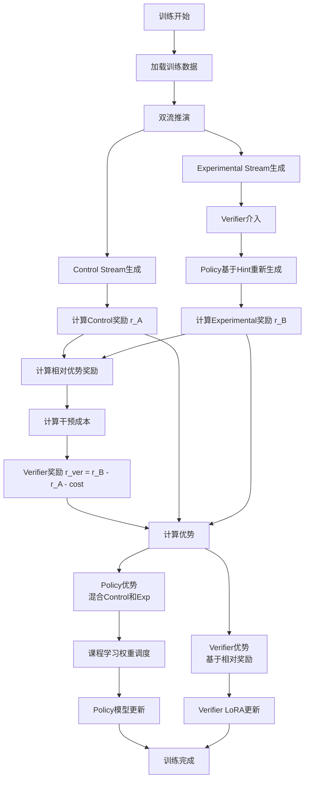
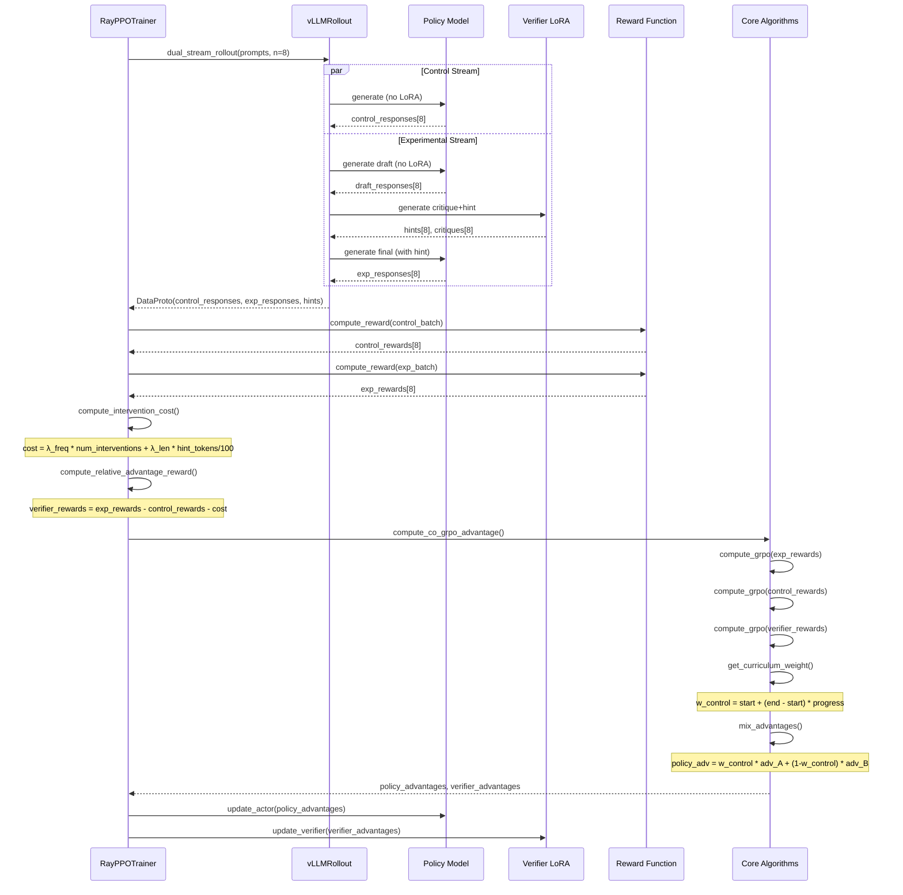

# Co-GRPO 算法详解 v1.0

**创建日期**: 2025-01-XX  
**版本**: v1.0  
**状态**: 生产就绪

---

## 📋 目录

1. [算法概述](#算法概述)
2. [核心创新](#核心创新)
3. [相比普通 GRPO 的优势](#相比普通-grpo-的优势)
4. [协同进化的 Verifier 设计](#协同进化的-verifier-设计)
5. [三种干预粒度详解](#三种干预粒度详解)
6. [Verifier LoRA 冷启动](#verifier-lora-冷启动)
7. [算法流程](#算法流程)
8. [关键技术细节](#关键技术细节)
9. [配置参数说明](#配置参数说明)
10. [性能与效果](#性能与效果)

---

## 算法概述

### 什么是 Co-GRPO？

**Co-GRPO (Cooperative Group Relative Policy Optimization)** 是一种双模型协同训练的强化学习算法，通过 **Policy 模型** 和 **Verifier 模型** 的协同进化来提升推理能力。

### 核心思想

Co-GRPO 将传统的单模型强化学习扩展为双流对比学习：

1. **Control Stream (控制流)**: Policy 独立生成，无 Verifier 指导
2. **Experimental Stream (实验流)**: Policy 在 Verifier 指导下生成
3. **对比学习**: 通过两个流的奖励差异，同时优化 Policy 和 Verifier

### 训练目标

- **Policy 模型**: 学习生成高质量响应，同时学会利用 Verifier 的指导
- **Verifier 模型**: 学习在关键时刻提供有效干预，提升 Policy 表现

---

## 核心创新

### 1. 双流对比机制

不同于普通 GRPO 的组内对比，Co-GRPO 引入了 **Control vs Experimental** 的对比：

```
普通 GRPO: 同一 prompt 的多个 responses 对比
Co-GRPO:  同一 prompt 的 control response vs experimental response 对比
```

### 2. 协同进化训练

Policy 和 Verifier 在训练过程中相互促进：
- Verifier 学会识别 Policy 的薄弱环节
- Policy 学会利用 Verifier 的指导改进生成
- 两者在训练中共同进化

### 3. 多粒度干预机制

Verifier 可以在三个不同粒度进行干预：
- **by_response**: 完整响应后介入
- **by_token**: Token 级别介入（理论设计）
- **by_step**: 步骤边界介入（推荐）

### 4. 干预正则化

防止 Verifier 过度干预，引入成本惩罚：
- **频率惩罚**: 惩罚干预次数过多
- **长度惩罚**: 惩罚 hint 过长

### 5. 课程学习 (Curriculum Learning)

动态调整 Control 和 Experimental 流的权重：
- **早期**: 更多依赖 Verifier (30% control, 70% exp)
- **后期**: 更多独立生成 (70% control, 30% exp)

---

## 相比普通 GRPO 的优势

### 1. 更强的推理能力

| 维度 | 普通 GRPO | Co-GRPO |
|------|-----------|---------|
| **训练信号** | 单一 reward | 相对优势 reward (r_B - r_A) |
| **学习目标** | 最大化 reward | 学习利用指导 + 独立生成 |
| **错误纠正** | 无 | Verifier 实时纠正 |
| **推理质量** | 标准 | 显著提升 |

### 2. 更好的泛化能力

- **普通 GRPO**: 只能从组内对比中学习，容易过拟合到特定模式
- **Co-GRPO**: 通过 Verifier 指导，学习更通用的推理模式

### 3. 更稳定的训练

- **普通 GRPO**: 依赖 reward 方差，训练不稳定
- **Co-GRPO**: 相对优势 reward 减少方差，训练更稳定

### 4. 可解释性

- **普通 GRPO**: 难以理解为什么某个 response 更好
- **Co-GRPO**: Verifier 的 critique 和 hint 提供可解释的指导

### 5. 持续改进能力

- **普通 GRPO**: 训练完成后无法继续改进
- **Co-GRPO**: Verifier 和 Policy 可以持续协同进化

---

## 协同进化的 Verifier 设计

### Verifier 的角色定位

Verifier 不是简单的奖励模型，而是一个**协同训练伙伴**：

1. **指导者 (Coach)**: 在 Policy 生成过程中提供实时指导
2. **评估者 (Evaluator)**: 评估 Policy 的推理质量
3. **学习者 (Learner)**: 从对比中学习何时、如何干预

### Verifier 的特殊改进

#### 1. 相对优势奖励 (Relative Advantage Reward)

**核心公式**:
```
R_verifier = r_B - r_A - cost
```

其中：
- `r_B`: Experimental stream 的奖励
- `r_A`: Control stream 的奖励
- `cost`: 干预成本（频率惩罚 + 长度惩罚）

**设计原理**:
- Verifier 的奖励不是绝对的好坏，而是**相对提升**
- 即使两个流都失败，只要 exp 比 control 好，Verifier 就有正奖励
- 这鼓励 Verifier 专注于**相对改进**而非绝对完美

#### 2. 干预成本机制

**频率惩罚**:
```python
freq_cost = λ_freq * num_interventions
```

**长度惩罚**:
```python
len_cost = λ_len * hint_token_counts / 100.0
```

**总成本**:
```python
total_cost = freq_cost + len_cost
verifier_reward = (r_B - r_A) - total_cost
```

**设计目的**:
- 防止 Verifier 过度干预（"hack" 系统）
- 鼓励 Verifier 在关键时刻精准介入
- 平衡干预频率和效果

#### 3. 三种粒度的干预机制

详见 [三种干预粒度详解](#三种干预粒度详解)

#### 4. 课程学习权重调度

**动态权重公式**:
```python
training_progress = current_step / total_steps
w_control = start_weight + (end_weight - start_weight) * progress
w_exp = 1 - w_control

policy_advantage = w_control * advantage_A + w_exp * advantage_B
```

**权重变化示例**:
```
Step 0/1000:    w_control = 0.3 (70% 依赖 Verifier)
Step 250/1000:  w_control = 0.4 (60% 依赖 Verifier)
Step 500/1000:  w_control = 0.5 (50% 平衡)
Step 750/1000:  w_control = 0.6 (40% 依赖 Verifier)
Step 1000/1000: w_control = 0.7 (30% 依赖 Verifier，更独立)
```

**设计目的**:
- **早期**: Policy 能力弱，需要 Verifier 大量指导
- **后期**: Policy 能力增强，应该更独立，Verifier 只在关键时刻介入
- 避免 Policy 过度依赖 Verifier

#### 5. Loss Mask 机制

在 `by_step` 模式中，需要排除 hint 部分计算 loss：

```python
# exp_loss_mask: hint 部分 = 0, model 生成部分 = 1
policy_loss = -policy_advantage * log_probs_B
policy_loss = policy_loss * exp_loss_mask  # 排除 hints
```

**设计目的**:
- Policy 不应该学习生成 hints（那是 Verifier 的任务）
- 只对 Policy 实际生成的部分计算 loss

---

## 三种干预粒度详解

### 1. by_response 模式

**特点**: 在完整响应生成后介入

**流程**:
```
1. Policy 生成完整 draft response
2. Verifier 读取 draft，生成 critique + hint
3. Policy 基于 hint 重新生成最终答案
```

**适用场景**:
- 默认模式，适合大多数任务
- 简单直接，易于实现
- 适合短响应（< 512 tokens）

**优点**:
- 实现简单
- 计算成本低
- 稳定可靠

**缺点**:
- 无法在生成过程中纠正错误
- 如果 draft 已经偏离，hint 可能无效

**代码位置**: `verl/workers/rollout/vllm_rollout/vllm_rollout.py:_dual_stream_rollout_by_response()`

---

### 2. by_token 模式

**特点**: 在每个 token 或固定间隔检查是否需要介入

**设计目标**:
- 实时监控生成过程
- 在错误发生前介入

**当前状态**: 
- 由于 vLLM API 限制，暂时回退到 `by_response` 模式
- 理论设计已完成，待 API 支持后实现

**预期流程**:
```
For each token or every N tokens:
    1. Verifier 检查当前生成状态
    2. 如果检测到问题 → 生成 hint
    3. Policy 基于 hint 继续生成
```

**适用场景**:
- 需要精细控制的场景
- 长文本生成
- 复杂推理任务

---

### 3. by_step 模式 ⭐️（推荐）

**特点**: 在步骤边界（step boundaries）介入

**核心创新**: 基于**语义原子**的步骤识别

#### 步骤边界识别

**识别方法**:
1. **思考结束标记**: `</think>`, `</think>`
2. **换行符边界**: `.\n`, `?\n`, `\n\n`
3. **逻辑词边界**: `Therefore`, `So`, `Thus` 等

**代码实现**:
```python
def _find_step_boundaries(self, response_tokens, tokenizer, device):
    """
    识别步骤边界，返回每个样本的边界索引列表
    """
    boundaries = []
    
    # 1. 识别思考结束标记
    think_end_token = tokenizer.encode("</think>")
    
    # 2. 识别换行符
    line_break_ids = [
        tokenizer.encode(".\n")[-1],
        tokenizer.encode("?\n")[-1],
        tokenizer.encode("\n\n")[-1],
    ]
    
    # 3. 组合所有边界
    for b in range(batch_size):
        # 找到所有边界点
        step_boundaries = find_all_boundaries(...)
        boundaries.append(step_boundaries)
    
    return boundaries
```

#### 干预决策机制

**决策流程**:
```
For each step boundary:
    1. 提取当前步骤的 context
    2. Verifier 评估是否需要干预
    3. 如果干预:
       - 生成 hint
       - 插入到步骤边界后
       - 更新 loss_mask (hint 部分 = 0)
    4. Policy 继续生成下一段
```

**干预条件**:
- **熵值过滤**: `entropy > threshold` → 可能有问题
- **置信度检查**: `confidence < threshold` → 需要干预
- **最大干预次数**: `num_interventions < max_interventions`

**代码位置**: `verl/workers/rollout/vllm_rollout/vllm_rollout.py:_dual_stream_rollout_by_step()`

#### 批量优化

**问题**: 每个样本可能有不同数量的步骤，如何批量处理？

**解决方案**: 
1. 收集所有 Verifier 输入
2. 批量 tokenize 和生成
3. 使用映射表分发结果

```python
# 收集所有 Verifier 输入
all_verifier_inputs = []
verifier_input_map = []  # (batch_idx, step_idx, boundary)

for b in range(batch_size):
    for step_idx, boundary in enumerate(valid_boundaries):
        verifier_input = construct_verifier_input(...)
        all_verifier_inputs.append(verifier_input)
        verifier_input_map.append((b, step_idx, boundary))

# 批量调用 Verifier
verifier_output = self.inference_engine.generate(
    prompt_token_ids=all_verifier_inputs,
    lora_request=verifier_lora_requests,
    ...
)

# 分发结果
for i, (batch_idx, step_idx, boundary) in enumerate(verifier_input_map):
    verifier_response = verifier_output[0][i]
    # 处理并存储
```

#### KV Cache 优化

**问题**: 每个 step 都传递完整历史，导致 KV Cache 未充分利用

**优化方案**:
1. 启用 vLLM Prefix Caching
2. 第一个 step: 传递完整历史
3. 后续 steps: 只传递增量 tokens

```python
# 第一个 step
if global_step == 0:
    full_input = prompt_tokens + response_tokens + hint_tokens
else:
    # 后续 steps: 只传递新生成的 tokens
    new_tokens = step_responses[0][len(prompt_tokens):]
    full_input = new_tokens
```

**预期收益**:
- KV Cache 命中率: ~0% → ~90%+
- 生成速度: 2-3x 提升
- GPU 内存: 降低 30-50%

**代码位置**: `verl/workers/rollout/vllm_rollout/vllm_rollout_spmd.py`

---

## Verifier LoRA 冷启动

### 为什么需要冷启动？

**问题**: 随机初始化的 Verifier LoRA 需要很长时间才能学到有用信号

**解决方案**: 使用 SFT (Supervised Fine-Tuning) 预训练 Verifier LoRA

### 冷启动数据生成 Pipeline

#### Pipeline 概述

基于 GRPO Rollout 数据，使用 Oracle 模型（gpt-oss-120B）进行"最佳干预点定位"。

**Pipeline 步骤**:

```
Step 1: 数据提取与分类
  └─> Pool A (正确样本) + Pool B (错误样本)

Step 2: 最佳干预点定位 (使用 Oracle)
  └─> 为每个错误样本找到最佳介入时刻

Step 3: 负样本组装
  └─> Warning 样本 + Correction 样本

Step 4: 正样本生成
  └─> GO 样本（正确路径，不需要干预）

Step 5: 数据混合与平衡
  └─> 80% GO + 10% Warning + 10% Correction
```

#### Step 1: 数据提取与分类

**输入**: GRPO Rollout 数据目录

**处理**:
- 读取所有 rollout JSONL 文件
- 根据 `acc` 字段分类：
  - `acc == 1` → Pool A (正确)
  - `acc == 0` → Pool B (错误)

**输出**:
- `pool_a_correct.jsonl`: 正确样本
- `pool_b_incorrect.jsonl`: 错误样本

**代码**: `scripts/verifier_data_gen/step1_extract_rollout_data.py`

---

#### Step 2: 最佳干预点定位 ⭐️

**核心创新**: 不再简单找第一个错误，而是找到"最佳介入时刻"

**Oracle Prompt 设计**:

```
Role: 你是一名时空穿越的数学导师。你看到了学生（模型）在未来犯错的全过程。
你的任务是回到过去，在**最佳时刻**发出一个简短的警告或纠正，改变未来。

Task: 分析 Wrong Response，找到导致错误的**最早**时刻。
决定你是要在错误发生**前**发出警告（Warning），还是在错误发生**后**立即纠正（Correction）。

Output Format (JSON):
{
    "intervention_type": "Warning" | "Correction",
    "insert_after_snippet": "引用Wrong Response中原文的最后5-10个字符，作为插入位置的锚点",
    "verifier_content": "<WAIT> [你的简短指导，15词以内，祈使句]"
}
```

**决策逻辑**:

- **Warning (预警)**: 如果下一句话是复杂的计算或易错的逻辑转换，请在**上一句话结束**或**逻辑词(Therefore/So)**之后插入
  - *Example*: Student says "So the area is...". Insert after "So ". Content: "<WAIT> Check the formula for circle area."

- **Correction (纠错)**: 如果这句话已经包含了明显的事实错误，请在这句话结束时插入
  - *Example*: Student says "15 * 10 = 140". Insert after "140". Content: "<WAIT> Recalculate. 15 * 10 is 150."

**约束条件**:
1. 锚点必须在原文中唯一且精确匹配
2. 绝对不要直接给出正确答案
3. 保持干预尽可能的少。只在致命错误点介入
4. verifier_content 必须以"<WAIT>"开头，严格控制在15个单词以内

**实现细节**:
- 使用 Oracle API 批量并行处理
- 支持断点续传（`--resume`）
- 错误处理和重试机制

**代码**: `scripts/verifier_data_gen/step2_optimal_intervention_localization.py`  
**Prompt 模板**: `scripts/verifier_data_gen/prompts/optimal_intervention_prompt.txt`

---

#### Step 3: 负样本组装

**输入**: `pool_b_with_interventions.jsonl` (包含 Oracle 输出的干预信息)

**处理**:
1. 根据 `insert_after_snippet` 定位插入点
2. 提取插入点之前的 context
3. 组装成 messages 格式：
   ```json
   {
     "messages": [
       {
         "role": "user",
         "content": "Question: ...\n\n[context before insertion]"
       },
       {
         "role": "assistant",
         "content": "<WAIT> [指导内容]"
       }
     ],
     "intervention_type": "Warning" | "Correction"
   }
   ```

**输出**:
- `negative_samples_warning.jsonl`: Warning 类型样本
- `negative_samples_correction.jsonl`: Correction 类型样本

**代码**: `scripts/verifier_data_gen/step3_assemble_negative_samples.py`

---

#### Step 4: 正样本生成

**输入**: `pool_a_correct.jsonl` (正确样本)

**处理**:
1. 使用语义切分工具对正确 response 进行切分
2. 为每个切分点生成 `<GO>` 标注
3. 组装成 messages 格式：
   ```json
   {
     "messages": [
       {
         "role": "user",
         "content": "Question: ...\n\n[context at split point]"
       },
       {
         "role": "assistant",
         "content": "<GO>"
       }
     ],
     "intervention_type": "GO"
   }
   ```

**语义切分**:
- 基于语义原子（句号、逗号、逻辑词）而非固定切分
- 确保切分点在语义上合理

**输出**: `positive_samples_go.jsonl`

**代码**: `scripts/verifier_data_gen/step4_generate_positive_samples.py`

---

#### Step 5: 数据混合与平衡

**输入**:
- `positive_samples_go.jsonl`
- `negative_samples_warning.jsonl`
- `negative_samples_correction.jsonl`

**处理**:
1. 按比例混合：
   - 80% GO (正样本)
   - 10% Warning (负样本)
   - 10% Correction (负样本)
2. 随机打乱
3. 验证数据格式

**设计原理**:
- **高信噪比**: 80% GO 确保 Verifier "平时沉默，关键时刻介入"
- **平衡训练**: 10% Warning + 10% Correction 确保 Verifier 学会两种干预类型

**输出**: `verifier_sft_train_data.jsonl`

**代码**: `scripts/verifier_data_gen/step5_balance_and_finalize.py`

---

### 冷启动训练

#### 训练配置

**LoRA 配置** (与 Co-GRPO 保持一致):
```yaml
lora_rank: 16
lora_alpha: 32
lora_dropout: 0.1
target_modules: ["q_proj", "v_proj", "k_proj", "o_proj"]
```

**训练参数**:
```yaml
epochs: 3
batch_size: 4
gradient_accumulation_steps: 8
learning_rate: 2e-4
warmup_steps: 100
```

#### 训练脚本

**一键运行**:
```bash
bash scripts/verifier_data_gen/run_verifier_data_pipeline_v2.sh \
    /path/to/rollout_data \
    ./verifier_data_output
```

**单独训练**:
```python
# 使用 HuggingFace Transformers + PEFT
python train_verifier_sft.py \
    --base_model /path/to/base_model \
    --data verifier_sft_train_data.jsonl \
    --output /path/to/verifier_lora \
    --lora_rank 16 \
    --lora_alpha 32 \
    --epochs 3
```

#### 数据量建议

- **最少**: 500-1000 条（验证流程）
- **推荐**: 5000-10000 条（高质量训练）
- **理想**: 10000+ 条（覆盖各种错误类型）

---

## 算法流程

### 完整训练流程



### 数据流图



---

## 关键技术细节

### 1. 优势计算

#### Policy 优势 (混合优势)

```python
# Experimental stream GRPO
exp_advantages, exp_returns = compute_grpo_outcome_advantage(
    token_level_rewards=exp_token_level_rewards,
    response_mask=exp_response_mask,
    index=uid,
    ...
)

# Control stream GRPO
control_advantages, control_returns = compute_grpo_outcome_advantage(
    token_level_rewards=control_token_level_rewards,
    response_mask=control_response_mask,
    index=uid,
    ...
)

# 动态权重混合
training_progress = current_step / total_steps
w_control = curriculum_start_weight + (curriculum_end_weight - curriculum_start_weight) * training_progress
w_exp = 1 - w_control

policy_advantages = w_control * control_advantages + w_exp * exp_advantages
```

#### Verifier 优势 (相对优势)

```python
# Verifier 相对奖励
verifier_rewards = exp_rewards - control_rewards - intervention_cost

# Verifier GRPO
verifier_advantages, verifier_returns = compute_grpo_outcome_advantage(
    token_level_rewards=verifier_token_level_rewards,
    response_mask=verifier_response_mask,
    index=uid,
    ...
)
```

### 2. Loss 计算

#### Policy Loss

```python
# 使用混合优势
policy_loss = -policy_advantages * log_probs_exp

# by_step 模式: 排除 hint 部分
if use_by_step_mode:
    policy_loss = policy_loss * exp_loss_mask  # hint 部分 = 0

# KL 惩罚
kl_loss = kl_coef * kl_divergence(policy, reference)
total_policy_loss = policy_loss + kl_loss
```

#### Verifier Loss

```python
# 使用 Verifier 优势
verifier_loss = -verifier_advantages * log_probs_verifier

# Verifier 损失权重
total_verifier_loss = verifier_loss_weight * verifier_loss
```

### 3. 干预成本计算

```python
def compute_intervention_cost(num_interventions, hint_token_counts, 
                              freq_coef=0.1, len_coef=0.01):
    """
    计算干预成本
    
    Args:
        num_interventions: 干预次数
        hint_token_counts: hint token 数量
        freq_coef: 频率惩罚系数
        len_coef: 长度惩罚系数（per 100 tokens）
    
    Returns:
        total_cost: 总成本
    """
    freq_cost = freq_coef * num_interventions
    len_cost = len_coef * hint_token_counts / 100.0
    total_cost = freq_cost + len_cost
    return total_cost

# 应用成本
verifier_reward = (exp_reward - control_reward) - total_cost
```

### 4. Verifier 决策解析

```python
def _parse_verifier_decision(verifier_text: str) -> dict:
    """
    解析 Verifier 输出，提取决策和 hint
    
    支持的格式:
    1. JSON: {"action": "Intervene", "hint": "..."}
    2. 简单: "Intervene: ..." 或 "Pass"
    3. 默认: 非空文本视为 Intervene
    """
    # 尝试解析 JSON
    json_match = re.search(r'\{[^}]+\}', verifier_text)
    if json_match:
        try:
            parsed = json.loads(json_match.group())
            return {
                "action": parsed.get("action", "Pass"),
                "hint": parsed.get("hint", "")
            }
        except:
            pass
    
    # 尝试简单格式
    if verifier_text.lower().startswith("intervene"):
        hint_match = re.search(r'intervene[:\s]+(.+)', verifier_text, re.IGNORECASE | re.DOTALL)
        if hint_match:
            return {"action": "Intervene", "hint": hint_match.group(1).strip()}
        else:
            return {"action": "Intervene", "hint": ""}
    elif verifier_text.lower().startswith("pass"):
        return {"action": "Pass", "hint": ""}
    else:
        # 默认: 非空文本视为 Intervene
        if verifier_text:
            return {"action": "Intervene", "hint": verifier_text}
        else:
            return {"action": "Pass", "hint": ""}
```

---

## 配置参数说明

### 核心配置

```yaml
# Co-GRPO 相关
algorithm:
  adv_estimator: co_grpo  # 必须设置为 co_grpo
  control_group_weight: 0.5  # Control 流权重（如果不使用 curriculum）
  
  # Verifier 干预模式
  verifier_intervention_mode: by_step  # by_response, by_token, by_step
  
  # by_step 模式参数
  token_check_interval: 5
  entropy_threshold: 0.5
  use_entropy_filter: True
  max_interventions: 3
  confidence_threshold: 0.7
  
  # 干预惩罚
  intervention_penalty:
    freq_coef: 0.1  # 频率惩罚系数
    len_coef: 0.01  # 长度惩罚系数（per 100 tokens）
  
  # 课程学习
  use_curriculum_weighting: True
  curriculum_start_weight: 0.3  # 初始 control 权重
  curriculum_end_weight: 0.7     # 最终 control 权重

# Verifier LoRA 配置
verifier:
  lora_rank: 16
  lora_alpha: 32
  lora_dropout: 0.1
  lora_path: "/path/to/verifier_lora"  # 冷启动训练的 LoRA 路径
  optim:
    lr: 1e-5
    lr_warmup_steps: 20
  loss_weight: 1.0
```

### 参数说明表

| 参数 | 类型 | 默认值 | 说明 |
|------|------|--------|------|
| `adv_estimator` | str | `"co_grpo"` | 优势估计器类型 |
| `verifier_intervention_mode` | str | `"by_step"` | Verifier 干预模式 |
| `control_group_weight` | float | `0.5` | Control 流权重（固定模式） |
| `use_curriculum_weighting` | bool | `True` | 是否使用课程学习 |
| `curriculum_start_weight` | float | `0.3` | 初始 control 权重 |
| `curriculum_end_weight` | float | `0.7` | 最终 control 权重 |
| `intervention_penalty.freq_coef` | float | `0.1` | 频率惩罚系数 |
| `intervention_penalty.len_coef` | float | `0.01` | 长度惩罚系数 |
| `max_interventions` | int | `3` | 最大干预次数 |
| `verifier.lora_rank` | int | `16` | Verifier LoRA rank |
| `verifier.optim.lr` | float | `1e-5` | Verifier 学习率 |

---

## 性能与效果

### 计算成本

| 指标 | 普通 GRPO | Co-GRPO | 倍数 |
|------|-----------|---------|------|
| **样本数/batch** | batch_size × n | batch_size × n × 2 | 2× |
| **生成调用** | 1× | 2-3× (双流 + Verifier) | 2-3× |
| **GPU 显存** | ~30GB | ~40GB | 1.3× |
| **训练速度** | 1× | ~0.4× | 0.4× |

### 预期效果

| 指标 | 普通 GRPO | Co-GRPO | 提升 |
|------|-----------|---------|------|
| **推理准确率** | 基准 | +5-10% | 显著提升 |
| **训练稳定性** | 标准 | 更稳定 | 相对优势减少方差 |
| **泛化能力** | 标准 | 更好 | Verifier 指导提升泛化 |
| **可解释性** | 低 | 高 | Verifier critique 提供解释 |

### 关键指标

训练过程中需要监控的关键指标：

1. **co_grpo/control_reward/mean**: Control 流平均奖励
2. **co_grpo/exp_reward/mean**: Experimental 流平均奖励
3. **co_grpo/verification_advantage/mean**: 验证优势 (r_B - r_A)
4. **co_grpo/verifier_help_rate**: Verifier 帮助率（exp > control 的比例）
5. **co_grpo/num_interventions/mean**: 平均干预次数
6. **co_grpo/hint_token_counts/mean**: 平均 hint token 数

**理想值**:
- `verification_advantage > 0`: Verifier 有效
- `verifier_help_rate > 30%`: Verifier 在 30% 以上样本中有效
- `num_interventions < max_interventions`: 未过度干预

---

## 总结

### 核心创新点

1. **双流对比机制**: Control vs Experimental 对比学习
2. **协同进化训练**: Policy 和 Verifier 相互促进
3. **多粒度干预**: 三种干预模式适应不同场景
4. **干预正则化**: 防止过度干预
5. **课程学习**: 动态调整依赖程度
6. **冷启动机制**: Oracle 指导的 Verifier 预训练

### 适用场景

- ✅ 数学推理任务
- ✅ 科学问题解答
- ✅ 编程任务
- ✅ 复杂推理任务
- ✅ 需要可解释性的场景

### 不适用场景

- ❌ 简单分类任务（不需要复杂推理）
- ❌ 资源极度受限（计算成本高）
- ❌ 实时性要求极高（训练速度慢）

---

**文档版本**: v1.0  
**最后更新**: 2025-01-XX  
**维护者**: Co-GRPO Team


