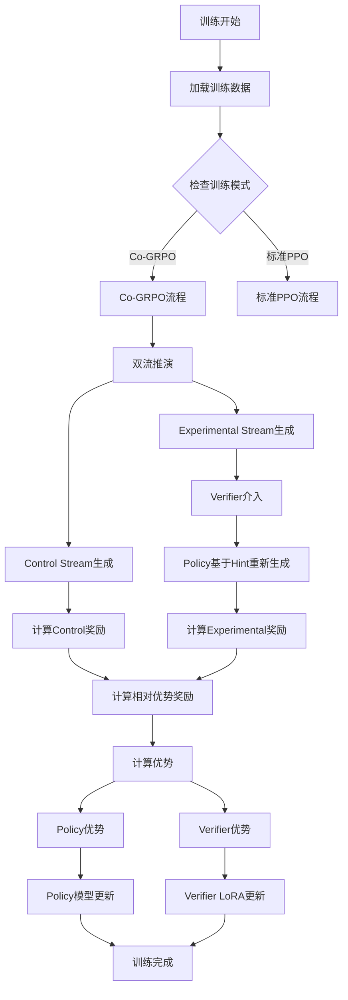
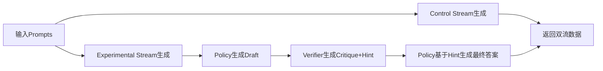
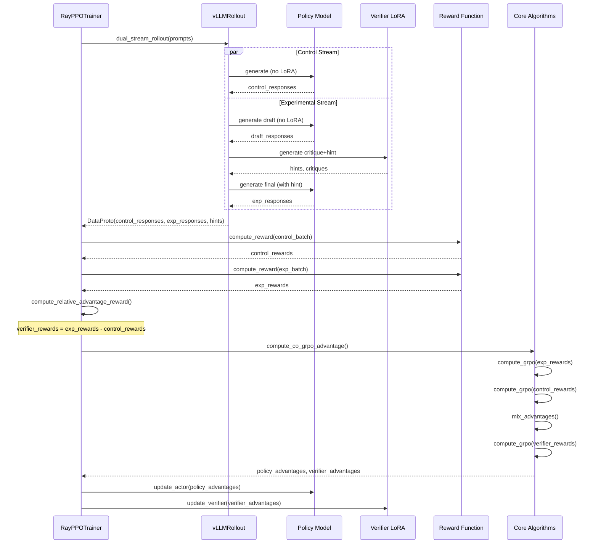
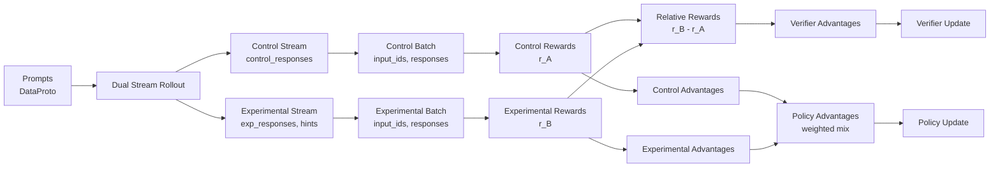

# Co-GRPO 在 verl 框架中的实现详解

## 目录

1. [概述](#概述)
2. [架构设计](#架构设计)
3. [核心流程](#核心流程)
4. [关键组件实现](#关键组件实现)
5. [数据流](#数据流)
6. [配置说明](#配置说明)

---

## 概述

Co-GRPO (Cooperative GRPO) 是一种双流强化学习训练方案，通过 Policy 和 Verifier 的协同训练来提升模型性能。在 verl 框架中的实现主要包括：

- **双流推演 (Dual-Stream Rollout)**: Control Stream 和 Experimental Stream 并行生成
- **相对优势奖励 (Relative Advantage Reward)**: Verifier 基于相对增益 (r_B - r_A) 进行训练
- **混合优势计算 (Mixed Advantage)**: Policy 从两个流中混合学习

---

## 架构设计

### 整体架构图



### 文件结构

```
verl/
├── trainer/ppo/
│   ├── ray_trainer.py          # 主训练器，协调整个训练流程
│   ├── core_algos.py            # 核心算法：compute_co_grpo_advantage
│   ├── reward.py                # 奖励计算：compute_relative_advantage_reward
│   └── metric_utils.py          # 指标计算：Co-GRPO特定指标
├── workers/
│   ├── rollout/vllm_rollout/
│   │   └── vllm_rollout.py      # 双流推演实现：dual_stream_rollout
│   └── fsdp_workers.py          # Worker初始化：Verifier LoRA配置
└── trainer/config/
    └── ppo_trainer.yaml         # 配置文件：Co-GRPO参数
```

---

## 核心流程

### 1. 训练主循环

**文件**: `verl/trainer/ppo/ray_trainer.py`

**入口函数**: `RayPPOTrainer.fit()` (Line 1003)

训练主循环在 `fit()` 方法中，关键代码片段：

```python:1068:1102:verl/trainer/ppo/ray_trainer.py
# Check if using Co-GRPO (dual-stream rollout)
use_co_grpo = self.config.algorithm.adv_estimator == AdvantageEstimator.CO_GRPO

if use_co_grpo:
    # Use dual-stream rollout for Co-GRPO
    if not self.async_rollout_mode:
        # Get intervention mode from config
        intervention_mode = self.config.algorithm.get("verifier_intervention_mode", "by_response")
        token_check_interval = self.config.algorithm.get("token_check_interval", 5)
        entropy_threshold = self.config.algorithm.get("entropy_threshold", 0.5)
        use_entropy_filter = self.config.algorithm.get("use_entropy_filter", True)
        
        # Call dual_stream_rollout (tokenizer is stored in rollout worker)
        gen_batch_output = self.actor_rollout_wg.dual_stream_rollout(
            gen_batch,
            intervention_mode=intervention_mode,
            token_check_interval=token_check_interval,
            entropy_threshold=entropy_threshold,
            use_entropy_filter=use_entropy_filter,
        )
```

**功能说明**:
- 检查是否使用 Co-GRPO 模式（通过 `adv_estimator == CO_GRPO` 判断）
- 从配置中读取介入模式参数
- 调用 `dual_stream_rollout` 进行双流推演

### 2. 双流推演 (Dual-Stream Rollout)

**文件**: `verl/workers/rollout/vllm_rollout/vllm_rollout.py`

**核心函数**: `vLLMRollout.dual_stream_rollout()` (Line 344)

#### 2.1 方法签名和路由

```python:344:404:verl/workers/rollout/vllm_rollout/vllm_rollout.py
def dual_stream_rollout(
    self, 
    prompts: DataProto, 
    intervention_mode: str = "by_response",
    token_check_interval: int = 5,
    entropy_threshold: float = 0.5,
    use_entropy_filter: bool = True,
    **kwargs
) -> DataProto:
    """
    Perform dual-stream rollout for Co-GRPO:
    - Control Stream: Policy generates without Verifier guidance
    - Experimental Stream: Policy generates with Verifier intervention based on mode
    """
    # ... 初始化代码 ...
    
    # Route to appropriate intervention mode
    if intervention_mode == "by_response":
        return self._dual_stream_rollout_by_response(...)
    elif intervention_mode == "by_token":
        return self._dual_stream_rollout_by_token(...)
    elif intervention_mode == "by_step":
        return self._dual_stream_rollout_by_step(...)
```

**功能说明**:
- 根据 `intervention_mode` 路由到不同的介入模式实现
- 支持三种模式：`by_response`（完整响应后介入）、`by_token`（token级介入）、`by_step`（步骤边界介入）

#### 2.2 by_response 模式实现

**函数**: `_dual_stream_rollout_by_response()` (Line 406)



**关键代码**:

```python:414:587:verl/workers/rollout/vllm_rollout/vllm_rollout.py
# ========== Control Stream: Policy generates without guidance ==========
# Generate control responses (no LoRA)
control_output = self.inference_engine.generate(
    prompts=None,
    sampling_params=self.sampling_params,
    prompt_token_ids=idx_list,
    lora_request=None,  # No LoRA for control stream
    use_tqdm=False,
)

# ========== Experimental Stream: Policy -> Verifier -> Policy ==========
# Step 1: Policy generates initial draft (CoT)
draft_output = self.inference_engine.generate(
    prompts=None,
    sampling_params=self.sampling_params,
    prompt_token_ids=idx_list,
    lora_request=None,  # No LoRA for initial draft
    use_tqdm=False,
)

# Step 2: Verifier generates Critique + Hint (using Verifier LoRA)
verifier_output = self.inference_engine.generate(
    prompts=None,
    sampling_params=self.sampling_params,
    prompt_token_ids=verifier_idx_list,
    lora_request=verifier_lora_requests,  # Use Verifier LoRA
    use_tqdm=False,
)

# Step 3: Policy generates final answer with Verifier guidance
final_output = self.inference_engine.generate(
    prompts=None,
    sampling_params=self.sampling_params,
    prompt_token_ids=final_idx_list,
    lora_request=None,  # Back to Policy
    use_tqdm=False,
)
```

**数据流**:
1. **Control Stream**: Policy 直接生成完整响应（无 Verifier 介入）
2. **Experimental Stream**:
   - Policy 生成初始 draft
   - Verifier 读取 draft，生成 critique 和 hint
   - Policy 基于 hint 生成最终答案

**返回数据结构**:
```python
DataProto(
    batch={
        "control_responses": torch.Tensor,      # Control流响应
        "exp_responses": torch.Tensor,          # Experimental流响应
        "control_input_ids": torch.Tensor,      # Control流完整序列
        "exp_input_ids": torch.Tensor,          # Experimental流完整序列
        "control_attention_mask": torch.Tensor,
        "exp_attention_mask": torch.Tensor,
        "control_response_mask": torch.Tensor,  # Response mask
        "exp_response_mask": torch.Tensor,
        # ... 其他字段
    },
    non_tensor_batch={
        "hints": np.array,                      # Verifier生成的hints
        "critiques": np.array,                  # Verifier生成的critiques
        "draft_responses": np.array,            # 初始draft
    }
)
```

### 3. 奖励计算

**文件**: `verl/trainer/ppo/ray_trainer.py`

**位置**: `fit()` 方法中的奖励计算部分 (Line 1161-1243)

#### 3.1 双流奖励计算

```python:1161:1243:verl/trainer/ppo/ray_trainer.py
# For Co-GRPO, compute rewards for both control and experimental streams
if use_co_grpo:
    # Compute rewards for control stream
    control_batch = batch.select(
        batch_keys=["control_input_ids", "control_attention_mask", "control_position_ids"],
        non_tensor_batch_keys=["uid"]
    )
    control_batch.batch["input_ids"] = control_batch.batch.pop("control_input_ids")
    control_batch.batch["attention_mask"] = control_batch.batch.pop("control_attention_mask")
    control_batch.batch["position_ids"] = control_batch.batch.pop("control_position_ids")
    control_batch.batch["responses"] = batch.batch["control_responses"]
    
    # Compute rewards for experimental stream
    exp_batch = batch.select(
        batch_keys=["exp_input_ids", "exp_attention_mask", "exp_position_ids"],
        non_tensor_batch_keys=["uid"]
    )
    exp_batch.batch["input_ids"] = exp_batch.batch.pop("exp_input_ids")
    exp_batch.batch["attention_mask"] = exp_batch.batch.pop("exp_attention_mask")
    exp_batch.batch["position_ids"] = exp_batch.batch.pop("exp_position_ids")
    exp_batch.batch["responses"] = batch.batch["exp_responses"]
    
    # 调用奖励函数
    control_reward_tensor, _ = compute_reward(control_batch, self.reward_fn)
    exp_reward_tensor, _ = compute_reward(exp_batch, self.reward_fn)
    
    # 确保奖励是token级别的
    if control_reward_tensor.dim() == 1:
        control_token_rewards = control_reward_tensor.unsqueeze(-1).expand(-1, control_resp_len)
    else:
        control_token_rewards = control_reward_tensor
    
    if exp_reward_tensor.dim() == 1:
        exp_token_rewards = exp_reward_tensor.unsqueeze(-1).expand(-1, exp_resp_len)
    else:
        exp_token_rewards = exp_reward_tensor
    
    # 存储奖励
    batch.batch["control_token_level_rewards"] = control_token_rewards
    batch.batch["exp_token_level_rewards"] = exp_token_rewards
```

**功能说明**:
- 分别构建 Control 和 Experimental 流的 batch
- 调用奖励函数计算两个流的奖励
- 将奖励扩展到 token 级别（如果原本是 outcome 级别）

#### 3.2 相对优势奖励计算

**文件**: `verl/trainer/ppo/reward.py`

**函数**: `compute_relative_advantage_reward()` (Line 164)

```python:164:175:verl/trainer/ppo/reward.py
def compute_relative_advantage_reward(control_rewards: torch.Tensor, exp_rewards: torch.Tensor) -> torch.Tensor:
    """
    Computes the relative advantage reward for the Verifier.
    R_ver = r_B - r_A, where r_B is experimental reward and r_A is control reward.
    """
    assert control_rewards.shape == exp_rewards.shape, "Control and experimental rewards must have the same shape."
    relative_rewards = exp_rewards - control_rewards
    return relative_rewards
```

**在训练器中的使用**:

```python:1217:1240:verl/trainer/ppo/ray_trainer.py
# Compute verifier relative rewards: r_B - r_A (outcome level)
from verl.trainer.ppo.reward import compute_relative_advantage_reward

def get_outcome_reward(token_rewards):
    """Convert token-level rewards to outcome rewards if needed."""
    if token_rewards.dim() == 1:
        return token_rewards
    elif token_rewards.size(-1) == 1:
        return token_rewards.squeeze(-1)
    else:
        return token_rewards.sum(dim=-1)

control_outcome = get_outcome_reward(control_token_rewards)
exp_outcome = get_outcome_reward(exp_token_rewards)
verifier_outcome_rewards = compute_relative_advantage_reward(
    control_rewards=control_outcome,
    exp_rewards=exp_outcome
)
# Expand to token level for verifier
batch.batch["verifier_token_level_rewards"] = verifier_outcome_rewards.unsqueeze(-1).expand(-1, exp_resp_len)
batch.batch["verifier_response_mask"] = batch.batch["exp_response_mask"]
```

**功能说明**:
- 将 token 级别奖励转换为 outcome 级别
- 计算相对优势：`R_ver = r_B - r_A`
- 扩展回 token 级别用于 Verifier 训练

### 4. 优势计算

**文件**: `verl/trainer/ppo/core_algos.py`

**函数**: `compute_co_grpo_advantage()` (Line 380)

#### 4.1 函数签名

```python:380:416:verl/trainer/ppo/core_algos.py
def compute_co_grpo_advantage(
    token_level_rewards: torch.Tensor,  # Experimental stream rewards
    response_mask: torch.Tensor,          # Experimental stream mask
    index: np.ndarray,                    # Group ID per sample
    control_token_level_rewards: torch.Tensor = None,  # Control stream rewards
    control_response_mask: torch.Tensor = None,        # Control stream mask
    verifier_token_level_rewards: torch.Tensor = None, # Verifier relative rewards
    verifier_response_mask: torch.Tensor = None,        # Verifier mask
    epsilon: float = 1e-6,
    norm_adv_by_std_in_grpo: bool = True,
    control_group_weight: float = 0.5,
    config=None,
):
    """
    Compute advantage for Co-GRPO:
    - Policy advantage: Mixed training from both Control and Experimental streams
    - Verifier advantage: Based on relative advantage (r_B - r_A)
    """
```

#### 4.2 实现逻辑

```python:417:467:verl/trainer/ppo/core_algos.py
# Compute Policy advantages from both Control and Experimental streams
# Experimental stream GRPO
exp_advantages, exp_returns = compute_grpo_outcome_advantage(
    token_level_rewards=token_level_rewards,
    response_mask=response_mask,
    index=index,
    epsilon=epsilon,
    norm_adv_by_std_in_grpo=norm_adv_by_std_in_grpo,
)

# Control stream GRPO (if provided)
if control_token_level_rewards is not None and control_response_mask is not None:
    control_advantages, control_returns = compute_grpo_outcome_advantage(
        token_level_rewards=control_token_level_rewards,
        response_mask=control_response_mask,
        index=index,
        epsilon=epsilon,
        norm_adv_by_std_in_grpo=norm_adv_by_std_in_grpo,
    )
    
    # Mix advantages: weighted combination
    if exp_advantages.shape == control_advantages.shape:
        policy_advantages = (1 - control_group_weight) * exp_advantages + control_group_weight * control_advantages
        policy_returns = (1 - control_group_weight) * exp_returns + control_group_weight * control_returns
    else:
        logger.warning(f"Shape mismatch: exp {exp_advantages.shape} vs control {control_advantages.shape}, using experimental only")
        policy_advantages = exp_advantages
        policy_returns = exp_returns
else:
    # Only experimental stream available
    policy_advantages = exp_advantages
    policy_returns = exp_returns

# Compute Verifier advantages (if verifier rewards provided)
verifier_advantages = None
verifier_returns = None
if verifier_token_level_rewards is not None and verifier_response_mask is not None:
    verifier_advantages, verifier_returns = compute_grpo_outcome_advantage(
        token_level_rewards=verifier_token_level_rewards,
        response_mask=verifier_response_mask,
        index=index,
        epsilon=epsilon,
        norm_adv_by_std_in_grpo=norm_adv_by_std_in_grpo,
    )

return policy_advantages, verifier_advantages, policy_returns, verifier_returns
```

**功能说明**:
- **Policy 优势**: 混合 Control 和 Experimental 流的优势，权重由 `control_group_weight` 控制
- **Verifier 优势**: 基于相对优势奖励计算，使用 GRPO 方法

#### 4.3 在训练器中的调用

**文件**: `verl/trainer/ppo/ray_trainer.py`

**位置**: `compute_advantage()` 函数 (Line 338-373)

```python:338:373:verl/trainer/ppo/ray_trainer.py
elif adv_estimator == AdvantageEstimator.CO_GRPO:
    # Co-GRPO: Dual-stream advantage computation
    # Control stream mask
    control_response_mask = data.batch.get("control_response_mask", data.batch["response_mask"])
    exp_response_mask = data.batch.get("exp_response_mask", data.batch["response_mask"])
    
    # Get control and experimental rewards
    control_token_level_rewards = data.batch.get("control_token_level_rewards", None)
    exp_token_level_rewards = data.batch.get("exp_token_level_rewards", data.batch["token_level_rewards"])
    
    # Get verifier rewards (relative advantage: r_B - r_A)
    verifier_token_level_rewards = data.batch.get("verifier_token_level_rewards", None)
    verifier_response_mask = data.batch.get("verifier_response_mask", None)
    
    control_group_weight = config.get("control_group_weight", 0.5)
    
    policy_advantages, verifier_advantages, policy_returns, verifier_returns = core_algos.compute_co_grpo_advantage(
        token_level_rewards=exp_token_level_rewards,
        response_mask=exp_response_mask,
        index=data.non_tensor_batch["uid"],
        control_token_level_rewards=control_token_level_rewards,
        control_response_mask=control_response_mask,
        verifier_token_level_rewards=verifier_token_level_rewards,
        verifier_response_mask=verifier_response_mask,
        norm_adv_by_std_in_grpo=norm_adv_by_std_in_grpo,
        control_group_weight=control_group_weight,
        config=config,
    )
    
    data.batch["advantages"] = policy_advantages
    data.batch["returns"] = policy_returns
    
    # Store verifier advantages separately if available
    if verifier_advantages is not None:
        data.batch["verifier_advantages"] = verifier_advantages
        data.batch["verifier_returns"] = verifier_returns
```

### 5. 模型更新

**文件**: `verl/trainer/ppo/ray_trainer.py`

#### 5.1 Policy 更新

Policy 更新使用标准的 PPO 更新逻辑，但使用的是混合后的优势：

```python:1564:1568:verl/trainer/ppo/ray_trainer.py
# update actor
with _timer("update_actor", timing_raw):
    batch.meta_info["multi_turn"] = self.config.actor_rollout_ref.rollout.multi_turn.enable
    actor_output = self.actor_rollout_wg.update_actor(batch)
```

**使用的优势**: `batch.batch["advantages"]` (Policy 混合优势)

#### 5.2 Verifier 更新

Verifier 使用独立的优化器和损失函数：

**文件**: `verl/workers/fsdp_workers.py`

Verifier LoRA 的初始化在 `ActorRolloutRefWorker._build_rollout()` 中：

```python
# Pass verifier_lora_config to vLLMRollout
if hasattr(self.config, "verifier_lora_config"):
    lora_kwargs["verifier_lora_config"] = self.config.verifier_lora_config
```

**注意**: Verifier 的更新逻辑需要在 `update_actor` 中实现，使用 `verifier_advantages` 和 `verifier_returns`。

### 6. 指标计算

**文件**: `verl/trainer/ppo/metric_utils.py`

**函数**: `compute_data_metrics()` 

Co-GRPO 特定指标的自动检测和计算：

```python
# Co-GRPO specific metrics
if "control_token_level_rewards" in batch.batch:
    control_rewards = batch.batch["control_token_level_rewards"].sum(-1)
    exp_rewards = batch.batch["exp_token_level_rewards"].sum(-1)
    verifier_advantages = batch.batch["verifier_advantages"]
    verifier_returns = batch.batch["verifier_returns"]

    # Calculate verifier help rate
    help_count = (exp_rewards > control_rewards).sum().item()
    total_samples = exp_rewards.size(0)
    verifier_help_rate = help_count / total_samples if total_samples > 0 else 0.0

    metrics.update({
        "co_grpo/control_reward/mean": torch.mean(control_rewards).detach().item(),
        "co_grpo/exp_reward/mean": torch.mean(exp_rewards).detach().item(),
        "co_grpo/verification_advantage/mean": torch.mean(exp_rewards - control_rewards).detach().item(),
        "co_grpo/verifier_help_rate": verifier_help_rate,
        "co_grpo/verifier_advantages/mean": torch.mean(verifier_advantages).detach().item(),
        # ... 更多指标
    })
```

**指标说明**:
- `co_grpo/control_reward/*`: Control 流奖励统计
- `co_grpo/exp_reward/*`: Experimental 流奖励统计
- `co_grpo/verification_advantage/*`: 验证优势 (r_B - r_A) 统计
- `co_grpo/verifier_help_rate`: Verifier 帮助率（exp > control 的比例）
- `co_grpo/verifier_advantages/*`: Verifier 优势统计

---

## 数据流

### 完整数据流图



### 数据结构转换



---

## 关键组件实现

### 1. Verifier LoRA 注册

**文件**: `verl/workers/rollout/vllm_rollout/vllm_rollout.py`

**函数**: `_register_verifier_lora()` (Line 297)

```python:297:336:verl/workers/rollout/vllm_rollout/vllm_rollout.py
def _register_verifier_lora(self, verifier_lora_path=None):
    """
    Register or load Verifier LoRA adapter.
    """
    if verifier_lora_path is None:
        # Try to find existing LoRA by name
        lora_int_ids = list(self.inference_engine.llm_engine.list_loras())
        if len(lora_int_ids) > 0:
            # Find verifier LoRA by name
            for lora_id in lora_int_ids:
                lora_info = self.inference_engine.llm_engine.get_lora_info(lora_id)
                if lora_info and self.verifier_lora_name in str(lora_info):
                    self.verifier_lora_int_id = lora_id
                    logger.info(f"Found existing Verifier LoRA with ID: {lora_id}")
                    return
```

**功能说明**:
- 在 vLLM 引擎中查找已注册的 Verifier LoRA
- 通过名称匹配找到对应的 LoRA ID
- 如果找不到，设置为 None（使用 base model）

### 2. 三种介入模式

#### 2.1 by_response 模式

**函数**: `_dual_stream_rollout_by_response()` (Line 406)

**流程**:
1. Policy 生成完整 draft
2. Verifier 读取 draft，生成 critique 和 hint
3. Policy 基于 hint 重新生成

**适用场景**: 默认模式，适合大多数任务

#### 2.2 by_token 模式

**函数**: `_dual_stream_rollout_by_token()` (Line 831)

**当前状态**: 由于 vLLM API 限制，暂时回退到 by_response 模式

**设计目标**: 每个 token 或固定间隔检查是否需要 Verifier 介入

#### 2.3 by_step 模式

**函数**: `_dual_stream_rollout_by_step()` (Line 854)

**关键函数**: `_find_step_boundaries()` (Line 755)

```python:755:829:verl/workers/rollout/vllm_rollout/vllm_rollout.py
def _find_step_boundaries(self, response_tokens: torch.Tensor, tokenizer, device) -> torch.Tensor:
    """
    Find step boundaries in response tokens using REPRO logic.
    """
    batch_size, seq_len = response_tokens.shape
    
    # Handle empty batch or zero sequence length
    if batch_size == 0 or seq_len == 0:
        return torch.zeros(batch_size, 1, dtype=torch.long, device=device)
    
    # Encode step boundary markers
    # - end_think_token_id: </think> or </think>
    # - line_break_ids: .\n, ?\n, \n\n, etc.
    
    # Find boundaries for each sample
    for b in range(batch_size):
        # Create think mask
        # Find line breaks
        # Combine masks
        # Get boundary indices
        boundaries.append(seq_len - 1)  # Always include the end
```

**功能说明**:
- 识别思考结束标记 (`</think>`, `</think>`)
- 识别换行符边界 (`.\n`, `?\n`, `\n\n`)
- 返回每个样本的边界索引

**批量处理优化**:

```python:955:1066:verl/workers/rollout/vllm_rollout/vllm_rollout.py
# Collect all Verifier inputs for batch processing
all_verifier_inputs = []
verifier_input_map = []  # List of (batch_idx, step_idx, boundary) tuples

for b in range(batch_size):
    for step_idx, boundary in enumerate(valid_boundaries):
        verifier_input = ...
        all_verifier_inputs.append(verifier_input)
        verifier_input_map.append((b, step_idx, boundary))

# Batch call Verifier
if all_verifier_inputs:
    verifier_encoded = tokenizer(all_verifier_inputs, ...)
    verifier_output = self.inference_engine.generate(...)
    
    # Distribute results to samples
    for i, (batch_idx, step_idx, boundary) in enumerate(verifier_input_map):
        verifier_response = verifier_output[0][i]
        # Process and store
```

**功能说明**:
- 收集所有 Verifier 输入
- 批量 tokenize 和生成
- 使用映射表分发结果到对应样本

### 3. Verifier 决策解析

**函数**: `_parse_verifier_decision()` (Line 711)

```python:711:753:verl/workers/rollout/vllm_rollout/vllm_rollout.py
def _parse_verifier_decision(self, verifier_text: str) -> dict:
    """
    Parse Verifier output to extract decision (Pass/Intervene) and hint.
    """
    verifier_text = verifier_text.strip()
    
    # Try to parse JSON-like format first
    json_match = re.search(r'\{[^}]+\}', verifier_text)
    if json_match:
        try:
            parsed = json.loads(json_match.group())
            return {
                "action": parsed.get("action", "Pass"),
                "hint": parsed.get("hint", "")
            }
        except:
            pass
    
    # Try to parse simple format: "Intervene: {hint}" or "Pass"
    if verifier_text.lower().startswith("intervene"):
        hint_match = re.search(r'intervene[:\s]+(.+)', verifier_text, re.IGNORECASE | re.DOTALL)
        if hint_match:
            return {"action": "Intervene", "hint": hint_match.group(1).strip()}
        else:
            return {"action": "Intervene", "hint": ""}
    elif verifier_text.lower().startswith("pass"):
        return {"action": "Pass", "hint": ""}
    else:
        # Default: if text is non-empty, treat as Intervene with hint
        if verifier_text:
            return {"action": "Intervene", "hint": verifier_text}
        else:
            return {"action": "Pass", "hint": ""}
```

**支持的格式**:
1. JSON 格式: `{"action": "Intervene", "hint": "..."}`
2. 简单格式: `"Intervene: ..."` 或 `"Pass"`
3. 默认: 非空文本视为 Intervene

---

## 配置说明

### 配置文件

**文件**: `verl/trainer/config/ppo_trainer.yaml`

### Co-GRPO 相关配置

```yaml
algorithm:
  # 优势估计器类型
  adv_estimator: co_grpo
  
  # Control组权重（Policy混合训练）
  control_group_weight: 0.5
  
  # Verifier介入模式
  verifier_intervention_mode: by_response  # by_response, by_token, by_step
  
  # by_token模式参数
  token_check_interval: 5
  entropy_threshold: 0.5
  use_entropy_filter: true
  
  # Verifier相对优势配置
  verifier_advantage_config:
    use_relative_reward: True
    filter_mode: "all"  # "all", "strict", "soft"

verifier:
  # Verifier LoRA配置
  lora_rank: 16
  lora_alpha: 32
  lora_dropout: 0.1
  target_modules: ["q_proj", "v_proj", "k_proj", "o_proj"]
  
  # Verifier优化器配置
  optim:
    lr: 1e-5
    lr_warmup_steps: 20
  
  # Verifier训练权重
  loss_weight: 1.0
```

### 配置参数说明

| 参数 | 类型 | 默认值 | 说明 |
|------|------|--------|------|
| `adv_estimator` | str | `"co_grpo"` | 优势估计器类型，必须设置为 `co_grpo` |
| `control_group_weight` | float | `0.5` | Control 流在 Policy 混合训练中的权重 |
| `verifier_intervention_mode` | str | `"by_response"` | Verifier 介入模式 |
| `token_check_interval` | int | `5` | by_token 模式的检查间隔 |
| `entropy_threshold` | float | `0.5` | 熵值阈值 |
| `use_entropy_filter` | bool | `True` | 是否启用熵值过滤 |
| `verifier.lora_rank` | int | `16` | Verifier LoRA 的 rank |
| `verifier.optim.lr` | float | `1e-5` | Verifier 学习率 |

---

## 总结

Co-GRPO 在 verl 框架中的实现包括以下核心组件：

1. **双流推演**: `vllm_rollout.py` 中的 `dual_stream_rollout()` 实现三种介入模式
2. **奖励计算**: `ray_trainer.py` 中分别计算 Control 和 Experimental 流奖励，然后计算相对优势
3. **优势计算**: `core_algos.py` 中的 `compute_co_grpo_advantage()` 实现混合优势计算
4. **模型更新**: Policy 使用混合优势更新，Verifier 使用相对优势更新
5. **指标监控**: `metric_utils.py` 中自动计算 Co-GRPO 特定指标

整个实现遵循 verl 框架的架构设计，通过 Ray 实现分布式训练，支持 FSDP 和 LoRA 等高效训练技术。

