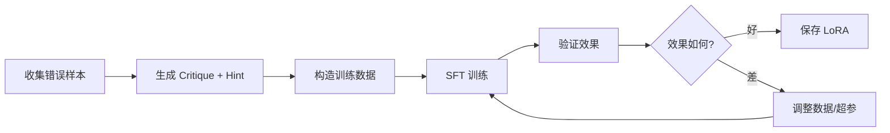

# Verifier LoRA 训练指南

**日期**: 2024-12-24  
**目的**: 训练 Verifier LoRA 适配器用于 Co-GRPO 训练

---

## 📋 目录

- [1. Verifier 的作用](#1-verifier-的作用)
- [2. 训练数据格式](#2-训练数据格式)
- [3. 数据来源与构造](#3-数据来源与构造)
- [4. 训练脚本](#4-训练脚本)
- [5. 训练流程](#5-训练流程)
- [6. 验证方法](#6-验证方法)

---

## 1. Verifier 的作用

### 1.1 在 Co-GRPO 中的角色

Verifier 是一个**指导者（Coach）**，它的任务是：

1. **输入**: `Prompt + Draft Reasoning`（Policy 的初始尝试）
2. **输出**: `Critique + Hint`（指出问题并提供改进建议）
3. **目标**: 帮助 Policy 生成更好的最终答案

### 1.2 输入输出格式

**输入格式**（在代码中）:
```
Prompt: {原始问题}

Draft Reasoning: {Policy 的初始推理过程}

Please provide critique and hint:
```

**输出格式**（期望）:
```
Critique: {指出 Draft 中的错误或不足}

Hint: {提供改进建议或关键思路}
```

**实际使用**（在最终 prompt 中）:
```
Prompt: {原始问题}

Critique and Hint: {Verifier 的输出}

Final Answer:
```

---

## 2. 训练数据格式

### 2.1 JSONL 格式（推荐）

每行一个 JSON 对象：

```json
{
  "prompt": "问题：求解方程 x^2 + 5x + 6 = 0",
  "draft_reasoning": "让我试试因式分解... (x+2)(x+3) = 0，所以 x = -2 或 x = -3",
  "critique": "思路正确，但计算有误。应该检查 (x+2)(x+3) = x^2 + 5x + 6，展开后确实等于原方程。",
  "hint": "使用因式分解法：找到两个数，它们的和是 5，积是 6。这两个数是 2 和 3。",
  "final_answer": "x = -2 或 x = -3"
}
```

### 2.2 完整示例

```json
{
  "prompt": "计算 ∫(0 to π) sin(x) dx",
  "draft_reasoning": "sin(x) 的积分是 -cos(x)，所以答案是 -cos(π) - (-cos(0)) = -(-1) - (-1) = 1 + 1 = 2",
  "critique": "计算过程正确，但符号处理有误。应该仔细检查每一步。",
  "hint": "记住：∫ sin(x) dx = -cos(x) + C。在 [0, π] 上，-cos(π) - (-cos(0)) = -(-1) - (-1) = 1 - (-1) = 2。",
  "final_answer": "2"
}
```

### 2.3 数据字段说明

| 字段 | 说明 | 必需 | 示例 |
|------|------|------|------|
| `prompt` | 原始问题 | ✅ | "求解方程..." |
| `draft_reasoning` | Policy 的初始推理（可能错误） | ✅ | "让我试试..." |
| `critique` | 对 Draft 的批评/指出问题 | ✅ | "思路正确，但..." |
| `hint` | 改进建议/关键思路 | ✅ | "使用因式分解法..." |
| `final_answer` | 正确答案（可选，用于验证） | ⚪ | "x = -2 或 x = -3" |

---

## 3. 数据来源与构造

### 3.1 数据来源（按优先级）

#### 方法 1: 从错误样本中构造 ⭐️（推荐）

**原理**: 收集 Policy 在训练中生成的错误答案，人工或自动生成 critique 和 hint。

**步骤**:
1. 运行 Policy 生成一批答案
2. 筛选出错误的答案（reward = 0）
3. 为每个错误答案生成 critique 和 hint
4. 构造训练数据

**示例脚本**:
```python
# 从训练日志中提取错误样本
def extract_error_samples(log_file):
    error_samples = []
    for line in open(log_file):
        data = json.loads(line)
        if data['reward'] == 0:  # 错误答案
            error_samples.append({
                'prompt': data['prompt'],
                'draft_reasoning': data['response'],
                'critique': generate_critique(data['response']),
                'hint': generate_hint(data['prompt'], data['response']),
            })
    return error_samples
```

#### 方法 2: 从现有数据集中构造

**原理**: 使用已有的数学/推理数据集，构造错误答案和对应的指导。

**步骤**:
1. 选择数据集（如 GSM8K, MATH, AIME）
2. 对每个问题，生成一个"常见错误"的 draft
3. 人工或自动生成 critique 和 hint

**示例**:
```python
# 从 GSM8K 构造数据
def construct_from_gsm8k(gsm8k_data):
    verifier_data = []
    for item in gsm8k_data:
        # 生成一个常见的错误推理
        draft = generate_common_mistake(item['question'])
        
        verifier_data.append({
            'prompt': item['question'],
            'draft_reasoning': draft,
            'critique': analyze_mistake(draft, item['answer']),
            'hint': provide_hint(item['question']),
            'final_answer': item['answer'],
        })
    return verifier_data
```

#### 方法 3: 人工标注

**原理**: 人工编写高质量的 critique 和 hint。

**优点**: 质量最高  
**缺点**: 成本高，数据量有限

**适用场景**: 
- 小规模高质量数据
- 特定领域的专业指导

#### 方法 4: 使用 LLM 生成（半自动）

**原理**: 使用 GPT-4/Claude 等强模型生成 critique 和 hint。

**步骤**:
```python
def generate_with_llm(prompt, draft_reasoning, correct_answer):
    system_prompt = """你是一个数学老师，需要指出学生推理中的错误并提供改进建议。"""
    
    user_prompt = f"""
问题: {prompt}

学生的推理: {draft_reasoning}

正确答案: {correct_answer}

请提供：
1. Critique: 指出推理中的错误或不足
2. Hint: 提供改进建议或关键思路
"""
    
    response = llm.generate(system_prompt, user_prompt)
    critique, hint = parse_response(response)
    return critique, hint
```

---

### 3.2 数据构造策略

#### 策略 A: 错误类型覆盖

确保覆盖常见的错误类型：

| 错误类型 | 示例 | Critique 重点 |
|---------|------|---------------|
| 计算错误 | 2+3=6 | 指出具体计算错误 |
| 逻辑错误 | 推理步骤跳跃 | 指出缺失的中间步骤 |
| 概念错误 | 误解定义 | 纠正概念理解 |
| 方法选择错误 | 用了复杂方法 | 建议更简单的方法 |

#### 策略 B: 难度梯度

- **简单**: 明显的错误，容易指出
- **中等**: 需要仔细分析才能发现
- **困难**: 需要深入理解才能指出

#### 策略 C: 指导风格

- **直接型**: "这里错了，应该..."
- **引导型**: "想想看，如果...会怎样？"
- **启发型**: "注意观察...这个模式..."

---

## 4. 训练脚本

### 4.1 使用 verl 的 SFT 训练

创建训练脚本 `train_verifier_sft.py`:

```python
#!/usr/bin/env python3
"""
训练 Verifier LoRA 适配器
使用 SFT (Supervised Fine-Tuning) 方法
"""

import json
import torch
from transformers import (
    AutoTokenizer, 
    AutoModelForCausalLM,
    TrainingArguments,
    Trainer,
    DataCollatorForLanguageModeling
)
from peft import LoraConfig, get_peft_model, TaskType
from datasets import Dataset

def load_verifier_data(data_path):
    """加载 Verifier 训练数据"""
    data = []
    with open(data_path, 'r') as f:
        for line in f:
            item = json.loads(line)
            # 构造输入
            input_text = f"Prompt: {item['prompt']}\n\nDraft Reasoning: {item['draft_reasoning']}\n\nPlease provide critique and hint:"
            # 构造输出
            output_text = f"Critique: {item['critique']}\n\nHint: {item['hint']}"
            data.append({
                'input': input_text,
                'output': output_text,
                'full_text': input_text + output_text
            })
    return data

def tokenize_function(examples, tokenizer, max_length=2048):
    """Tokenize 数据"""
    inputs = tokenizer(
        examples['full_text'],
        truncation=True,
        max_length=max_length,
        padding='max_length',
        return_tensors='pt'
    )
    
    # 创建 labels（只对 output 部分计算 loss）
    labels = inputs['input_ids'].clone()
    # 找到 input 部分的长度
    input_lengths = [len(tokenizer.encode(text, add_special_tokens=False)) for text in examples['input']]
    
    # 将 input 部分的 labels 设为 -100（不计算 loss）
    for i, input_len in enumerate(input_lengths):
        labels[i, :input_len] = -100
    
    inputs['labels'] = labels
    return inputs

def main():
    # 配置
    base_model_path = "/path/to/base_model"  # 与 Policy 共享的 base model
    data_path = "/path/to/verifier_data.jsonl"
    output_dir = "/path/to/verifier_lora"
    
    # LoRA 配置（与 ppo_trainer.yaml 保持一致）
    lora_config = LoraConfig(
        r=16,  # lora_rank
        lora_alpha=32,  # lora_alpha
        target_modules=["q_proj", "v_proj", "k_proj", "o_proj"],
        lora_dropout=0.1,
        bias="none",
        task_type=TaskType.CAUSAL_LM,
    )
    
    # 加载模型和 tokenizer
    tokenizer = AutoTokenizer.from_pretrained(base_model_path)
    if tokenizer.pad_token is None:
        tokenizer.pad_token = tokenizer.eos_token
    
    model = AutoModelForCausalLM.from_pretrained(
        base_model_path,
        torch_dtype=torch.bfloat16,
        device_map="auto",
    )
    
    # 应用 LoRA
    model = get_peft_model(model, lora_config)
    model.print_trainable_parameters()
    
    # 加载数据
    raw_data = load_verifier_data(data_path)
    dataset = Dataset.from_list(raw_data)
    
    # Tokenize
    tokenized_dataset = dataset.map(
        lambda x: tokenize_function(x, tokenizer),
        batched=True,
        remove_columns=dataset.column_names
    )
    
    # 训练参数
    training_args = TrainingArguments(
        output_dir=output_dir,
        num_train_epochs=3,
        per_device_train_batch_size=4,
        gradient_accumulation_steps=8,
        learning_rate=2e-4,  # 比 Co-GRPO 中的 lr 稍高
        warmup_steps=100,
        logging_steps=10,
        save_steps=500,
        save_total_limit=3,
        fp16=True,
        gradient_checkpointing=True,
        optim="adamw_torch",
        report_to="none",  # 或 "wandb"/"tensorboard"
    )
    
    # Data collator
    data_collator = DataCollatorForLanguageModeling(
        tokenizer=tokenizer,
        mlm=False,
    )
    
    # Trainer
    trainer = Trainer(
        model=model,
        args=training_args,
        train_dataset=tokenized_dataset,
        data_collator=data_collator,
    )
    
    # 训练
    trainer.train()
    
    # 保存
    model.save_pretrained(output_dir)
    tokenizer.save_pretrained(output_dir)
    
    print(f"✅ Verifier LoRA 已保存到: {output_dir}")

if __name__ == "__main__":
    main()
```

### 4.2 使用 HuggingFace Transformers（简化版）

如果不想用 verl，可以用标准的 HuggingFace 训练：

```bash
# 安装依赖
pip install transformers peft datasets accelerate

# 运行训练
python train_verifier_sft.py \
    --base_model /path/to/base_model \
    --data /path/to/verifier_data.jsonl \
    --output /path/to/verifier_lora \
    --lora_rank 16 \
    --lora_alpha 32 \
    --epochs 3 \
    --batch_size 4 \
    --lr 2e-4
```

---

## 5. 训练流程

### 5.1 完整流程



### 5.2 分阶段训练（推荐）

#### Phase 1: 小规模验证（1-2 天）

**目标**: 验证流程和格式

```bash
# 1. 准备小规模数据（100-500 条）
python prepare_verifier_data.py --size 500 --output verifier_data_small.jsonl

# 2. 训练 1 epoch
python train_verifier_sft.py \
    --data verifier_data_small.jsonl \
    --output verifier_lora_v1 \
    --epochs 1

# 3. 测试效果
python test_verifier.py --lora_path verifier_lora_v1
```

#### Phase 2: 完整训练（3-5 天）

**目标**: 训练高质量的 Verifier

```bash
# 1. 准备完整数据（5000-10000 条）
python prepare_verifier_data.py --size 10000 --output verifier_data_full.jsonl

# 2. 训练 3 epochs
python train_verifier_sft.py \
    --data verifier_data_full.jsonl \
    --output verifier_lora_final \
    --epochs 3 \
    --lr 2e-4

# 3. 验证
python test_verifier.py --lora_path verifier_lora_final
```

#### Phase 3: 迭代优化（持续）

**目标**: 根据 Co-GRPO 训练反馈优化

```bash
# 1. 从 Co-GRPO 训练中收集新数据
python collect_feedback.py --co_grpo_log co_grpo_train.log

# 2. 合并到训练集
python merge_data.py \
    --old verifier_data_full.jsonl \
    --new feedback_data.jsonl \
    --output verifier_data_v2.jsonl

# 3. 继续训练
python train_verifier_sft.py --data verifier_data_v2.jsonl
```

---

## 6. 验证方法

### 6.1 生成质量测试

```python
def test_verifier_generation(lora_path, test_data):
    """测试 Verifier 生成质量"""
    model = load_verifier_model(lora_path)
    
    for item in test_data:
        prompt = item['prompt']
        draft = item['draft_reasoning']
        
        # 构造输入
        input_text = f"Prompt: {prompt}\n\nDraft Reasoning: {draft}\n\nPlease provide critique and hint:"
        
        # 生成
        output = model.generate(input_text)
        
        # 评估
        print(f"Prompt: {prompt}")
        print(f"Draft: {draft}")
        print(f"Verifier Output: {output}")
        print(f"Expected Critique: {item['critique']}")
        print(f"Expected Hint: {item['hint']}")
        print("-" * 50)
```

### 6.2 在 Co-GRPO 中验证

```bash
# 使用训练好的 Verifier LoRA 运行 Co-GRPO
bash scripts/run_multinodes_co_grpo.sh \
    --verifier_lora_path /path/to/verifier_lora_final

# 监控指标
# 1. co_grpo/verification_advantage/mean > 0
# 2. co_grpo/verifier_help_rate > 30%
# 3. co_grpo/exp_reward/mean > co_grpo/control_reward/mean
```

### 6.3 评估标准

| 指标 | 标准 | 说明 |
|------|------|------|
| **生成质量** | Critique 准确指出错误 | 人工评估 |
| **帮助率** | verification_advantage > 0 的比例 > 30% | 自动评估 |
| **相对优势** | verification_advantage/mean > 0.1 | 自动评估 |
| **稳定性** | std < 0.5 | 自动评估 |

---

## 7. 数据示例

### 7.1 数学问题

```json
{
  "prompt": "求解方程: 2x^2 - 5x + 3 = 0",
  "draft_reasoning": "使用求根公式: x = (5 ± √(25-24)) / 4 = (5 ± 1) / 4，所以 x = 1.5 或 x = 1",
  "critique": "计算正确，但答案格式不标准。应该写成 x = 3/2 或 x = 1，或者 x = 1.5 或 x = 1。",
  "hint": "使用求根公式 x = (-b ± √(b²-4ac)) / 2a，其中 a=2, b=-5, c=3。计算判别式 Δ = 25-24 = 1。",
  "final_answer": "x = 1 或 x = 3/2"
}
```

### 7.2 推理问题

```json
{
  "prompt": "如果所有 A 都是 B，所有 B 都是 C，那么所有 A 都是 C 吗？",
  "draft_reasoning": "不一定，因为可能有些 A 不是 B。",
  "critique": "逻辑错误。题目已经明确说'所有 A 都是 B'，所以不存在'有些 A 不是 B'的情况。",
  "hint": "这是传递性推理。如果 A ⊆ B 且 B ⊆ C，则 A ⊆ C。用集合论或逻辑推理都可以证明。",
  "final_answer": "是的，所有 A 都是 C"
}
```

---

## 8. 常见问题

### Q1: 需要多少训练数据？

**A**: 
- **最少**: 500-1000 条（验证流程）
- **推荐**: 5000-10000 条（高质量训练）
- **理想**: 10000+ 条（覆盖各种错误类型）

### Q2: 训练多久？

**A**:
- **小规模验证**: 1 epoch, 1-2 小时
- **完整训练**: 3 epochs, 1-2 天（取决于数据量和 GPU）

### Q3: 如何判断训练效果？

**A**:
1. **生成质量**: Critique 和 Hint 是否准确、有用
2. **帮助率**: verification_advantage > 0 的比例 > 30%
3. **相对优势**: 在 Co-GRPO 中 exp_reward > control_reward
4. **稳定性**: verification_advantage 的 std 不要太大

### Q4: 训练数据从哪里来？

**A**: 推荐顺序：
1. **从错误样本构造**（最快）：收集 Policy 训练中的错误答案
2. **从数据集构造**：使用 GSM8K、MATH 等，生成常见错误
3. **LLM 生成**：用 GPT-4/Claude 生成 critique 和 hint
4. **人工标注**：高质量但成本高

### Q5: Verifier LoRA 需要和 Policy 共享 base model 吗？

**A**: **是的，必须共享**！
- Verifier 和 Policy 使用**同一个 base model**
- 只有 LoRA 适配器不同
- 这样可以在 vLLM 中实现 Multi-LoRA 快速切换

### Q6: 训练时 loss 不下降怎么办？

**A**: 检查以下几点：
1. **数据质量**: Critique 和 Hint 是否准确
2. **学习率**: 尝试 1e-4 到 5e-4
3. **LoRA rank**: 如果太小（<8），可能表达能力不足
4. **数据量**: 如果太少（<1000），可能过拟合

### Q7: 可以直接用随机初始化的 LoRA 吗？

**A**: **不推荐**！
- 随机初始化需要很长时间才能学到有用信号
- 建议先用 SFT 预训练，再在 Co-GRPO 中微调
- 即使只有 500-1000 条数据，SFT 预训练也能显著加速

### Q8: 如何持续改进 Verifier？

**A**: 迭代流程：
1. **收集反馈**: 从 Co-GRPO 训练中收集 verification_advantage < 0 的样本
2. **分析问题**: 找出 Verifier 指导失败的原因
3. **补充数据**: 针对性地添加训练数据
4. **重新训练**: 在原有 LoRA 基础上继续训练（增量学习）

---

## 9. 快速开始模板

### 9.1 数据准备脚本

创建 `prepare_verifier_data.py`:

```python
#!/usr/bin/env python3
"""
从错误样本中构造 Verifier 训练数据
"""

import json
import argparse
from typing import List, Dict

def load_error_samples(error_log_path: str) -> List[Dict]:
    """从训练日志中加载错误样本"""
    error_samples = []
    with open(error_log_path, 'r') as f:
        for line in f:
            data = json.loads(line)
            if data.get('reward', 1) == 0:  # 错误答案
                error_samples.append({
                    'prompt': data['prompt'],
                    'draft_reasoning': data['response'],
                    'correct_answer': data.get('correct_answer', ''),
                })
    return error_samples

def generate_critique_hint(prompt: str, draft: str, correct_answer: str) -> tuple:
    """
    生成 critique 和 hint
    这里可以用 LLM API 或规则生成
    """
    # 示例：简单规则生成（实际应该用 LLM）
    critique = f"检查推理过程：{draft[:100]}... 可能存在错误。"
    hint = f"参考正确答案：{correct_answer}，重新思考问题：{prompt[:50]}..."
    return critique, hint

def construct_verifier_data(error_samples: List[Dict]) -> List[Dict]:
    """构造 Verifier 训练数据"""
    verifier_data = []
    for sample in error_samples:
        critique, hint = generate_critique_hint(
            sample['prompt'],
            sample['draft_reasoning'],
            sample['correct_answer']
        )
        verifier_data.append({
            'prompt': sample['prompt'],
            'draft_reasoning': sample['draft_reasoning'],
            'critique': critique,
            'hint': hint,
            'final_answer': sample['correct_answer'],
        })
    return verifier_data

def main():
    parser = argparse.ArgumentParser()
    parser.add_argument('--error_log', type=str, required=True, help='错误样本日志文件')
    parser.add_argument('--output', type=str, required=True, help='输出 JSONL 文件')
    parser.add_argument('--size', type=int, default=None, help='限制数据量')
    args = parser.parse_args()
    
    # 加载错误样本
    error_samples = load_error_samples(args.error_log)
    if args.size:
        error_samples = error_samples[:args.size]
    
    # 构造数据
    verifier_data = construct_verifier_data(error_samples)
    
    # 保存
    with open(args.output, 'w') as f:
        for item in verifier_data:
            f.write(json.dumps(item, ensure_ascii=False) + '\n')
    
    print(f"✅ 已生成 {len(verifier_data)} 条 Verifier 训练数据: {args.output}")

if __name__ == "__main__":
    main()
```

### 9.2 一键训练脚本

创建 `train_verifier.sh`:

```bash
#!/bin/bash
# Verifier LoRA 一键训练脚本

set -e

# 配置
BASE_MODEL="/path/to/base_model"
DATA_PATH="/path/to/verifier_data.jsonl"
OUTPUT_DIR="/path/to/verifier_lora"
LORA_RANK=16
LORA_ALPHA=32
EPOCHS=3
BATCH_SIZE=4
LR=2e-4

# 检查数据
if [ ! -f "$DATA_PATH" ]; then
    echo "❌ 数据文件不存在: $DATA_PATH"
    exit 1
fi

# 检查数据量
DATA_SIZE=$(wc -l < "$DATA_PATH")
echo "📊 训练数据量: $DATA_SIZE 条"

# 训练
echo "🚀 开始训练 Verifier LoRA..."
python train_verifier_sft.py \
    --base_model "$BASE_MODEL" \
    --data "$DATA_PATH" \
    --output "$OUTPUT_DIR" \
    --lora_rank "$LORA_RANK" \
    --lora_alpha "$LORA_ALPHA" \
    --epochs "$EPOCHS" \
    --batch_size "$BATCH_SIZE" \
    --lr "$LR"

echo "✅ 训练完成！LoRA 保存在: $OUTPUT_DIR"
echo ""
echo "📝 下一步："
echo "1. 测试效果: python test_verifier.py --lora_path $OUTPUT_DIR"
echo "2. 在 Co-GRPO 中使用: 配置 verifier.lora_path = $OUTPUT_DIR"
```

### 9.3 测试脚本

创建 `test_verifier.py`:

```python
#!/usr/bin/env python3
"""
测试 Verifier LoRA 生成质量
"""

import json
import argparse
from transformers import AutoTokenizer, AutoModelForCausalLM
from peft import PeftModel

def load_verifier_model(base_model_path: str, lora_path: str):
    """加载 Verifier 模型"""
    tokenizer = AutoTokenizer.from_pretrained(base_model_path)
    if tokenizer.pad_token is None:
        tokenizer.pad_token = tokenizer.eos_token
    
    model = AutoModelForCausalLM.from_pretrained(
        base_model_path,
        torch_dtype=torch.bfloat16,
        device_map="auto",
    )
    model = PeftModel.from_pretrained(model, lora_path)
    model.eval()
    
    return model, tokenizer

def generate_verifier_output(model, tokenizer, prompt: str, draft: str, max_length=512):
    """生成 Verifier 输出"""
    input_text = f"Prompt: {prompt}\n\nDraft Reasoning: {draft}\n\nPlease provide critique and hint:"
    
    inputs = tokenizer(input_text, return_tensors="pt").to(model.device)
    
    with torch.no_grad():
        outputs = model.generate(
            **inputs,
            max_length=max_length,
            temperature=0.7,
            do_sample=True,
            pad_token_id=tokenizer.eos_token_id,
        )
    
    response = tokenizer.decode(outputs[0][inputs['input_ids'].shape[1]:], skip_special_tokens=True)
    return response

def main():
    parser = argparse.ArgumentParser()
    parser.add_argument('--base_model', type=str, required=True)
    parser.add_argument('--lora_path', type=str, required=True)
    parser.add_argument('--test_data', type=str, required=True)
    args = parser.parse_args()
    
    # 加载模型
    print("📦 加载模型...")
    model, tokenizer = load_verifier_model(args.base_model, args.lora_path)
    
    # 加载测试数据
    test_samples = []
    with open(args.test_data, 'r') as f:
        for line in f:
            test_samples.append(json.loads(line))
    
    # 测试
    print(f"\n🧪 测试 {len(test_samples)} 个样本...\n")
    for i, sample in enumerate(test_samples[:10]):  # 只测试前 10 个
        print(f"样本 {i+1}:")
        print(f"Prompt: {sample['prompt'][:100]}...")
        print(f"Draft: {sample['draft_reasoning'][:100]}...")
        
        output = generate_verifier_output(
            model, tokenizer,
            sample['prompt'],
            sample['draft_reasoning']
        )
        
        print(f"Verifier Output:\n{output}\n")
        print(f"Expected Critique: {sample['critique'][:100]}...")
        print(f"Expected Hint: {sample['hint'][:100]}...")
        print("-" * 80)

if __name__ == "__main__":
    import torch
    main()
```

---

## 10. 最佳实践

### 10.1 数据质量 > 数据量

- ✅ **1000 条高质量数据** > 10000 条低质量数据
- ✅ 确保 critique 准确指出错误
- ✅ 确保 hint 提供有用的指导

### 10.2 分阶段训练

1. **Phase 1**: 小规模验证（500-1000 条，1 epoch）
2. **Phase 2**: 完整训练（5000-10000 条，3 epochs）
3. **Phase 3**: 迭代优化（根据 Co-GRPO 反馈持续改进）

### 10.3 错误类型覆盖

确保训练数据覆盖：
- ✅ 计算错误
- ✅ 逻辑错误
- ✅ 概念错误
- ✅ 方法选择错误

### 10.4 与 Co-GRPO 配置一致

```yaml
# ppo_trainer.yaml
verifier:
  lora_rank: 16      # 必须与训练时一致
  lora_alpha: 32     # 必须与训练时一致
  target_modules: ["q_proj", "v_proj", "k_proj", "o_proj"]  # 必须一致
```

---

## 11. 故障排查

### 问题 1: 训练 loss 不下降

**可能原因**:
- 数据格式错误
- 学习率太小
- LoRA rank 太小

**解决方案**:
```bash
# 检查数据格式
python -c "import json; [print(json.loads(l)) for l in open('data.jsonl')][:3]"

# 尝试更高学习率
--lr 5e-4

# 增大 LoRA rank
--lora_rank 32
```

### 问题 2: 生成质量差

**可能原因**:
- 训练数据不足
- 训练不充分
- 数据质量差

**解决方案**:
- 增加训练数据
- 增加训练轮数
- 检查 critique 和 hint 是否准确

### 问题 3: 在 Co-GRPO 中无效

**可能原因**:
- LoRA 未正确加载
- 配置不一致
- Verifier 输出格式不对

**解决方案**:
```bash
# 检查 LoRA 是否正确加载
# 查看训练日志中的警告信息

# 验证配置
grep -A 5 "verifier:" config.yaml

# 检查输出格式
# Verifier 输出应该包含 "Critique:" 和 "Hint:"
```

---

## 12. 总结

### 关键要点

1. **数据格式**: 
   ```
   Prompt: {prompt}
   Draft Reasoning: {draft}
   → Critique: {critique}
   → Hint: {hint}
   ```

2. **训练方法**: SFT (Supervised Fine-Tuning)

3. **配置要求**: 与 Co-GRPO 配置保持一致

4. **数据来源**: 错误样本 > 数据集构造 > LLM 生成 > 人工标注

5. **训练流程**: 小规模验证 → 完整训练 → 迭代优化

### 推荐配置

```yaml
# LoRA 配置
lora_rank: 16
lora_alpha: 32
lora_dropout: 0.1
target_modules: ["q_proj", "v_proj", "k_proj", "o_proj"]

# 训练配置
epochs: 3
batch_size: 4
gradient_accumulation_steps: 8
learning_rate: 2e-4
warmup_steps: 100
```

### 成功标准

- ✅ 生成质量: Critique 准确，Hint 有用
- ✅ 帮助率: verification_advantage > 0 的比例 > 30%
- ✅ 相对优势: exp_reward > control_reward
- ✅ 稳定性: verification_advantage std < 0.5

---

## 13. 参考资料

### 相关文档

- `co-grpo-implementation-report.md` - Co-GRPO 完整实现
- `CO_GRPO_METRICS.md` - 训练指标说明
- `FIXES_SUMMARY.md` - 快速参考

### 代码位置

- Verifier 输入格式: `verl/workers/rollout/vllm_rollout/vllm_rollout.py:445-449`
- Verifier 配置: `verl/trainer/config/ppo_trainer.yaml:882-896`

### 外部资源

- PEFT 文档: https://huggingface.co/docs/peft
- LoRA 论文: https://arxiv.org/abs/2106.09685
- SFT 最佳实践: https://huggingface.co/docs/transformers/training

---

**文档完成日期**: 2024-12-24  
**版本**: v1.0  
**状态**: ✅ 完整

**祝训练顺利！** 🚀